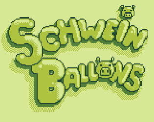

# \#GBJAM

  

## English

This repository contains  [Schweinballon](http://gamejolt.com/games/schweinballon/86874), a game for [#GBJam 4](http://www.gbjam.net/) by [@DJPIE1337](https://twitter.com/DJPIE1337),  [@Kokonaught](https://twitter.com/Kokonaught/),  [@iLambda2](https://twitter.com/iLambda2) and [@pauljoannon](https://twitter.com/pauljoannon).

Follow a pig dad in his journey to free his sons who've been kidnapped by evil boars.  

Source code is released under [MIT license](https://github.com/mysweetwhomp/gbjam4/blob/master/LICENSE).  
Assets (audio and graphics) are released under the terms of [CC BY-NC-SA 4.0 ](http://creativecommons.org/licenses/by-nc-sa/4.0/).

## Français

Ce dépôt contient [Schweinballon](http://gamejolt.com/games/schweinballon/86874), un jeu pour la [#GBJam 4](http://www.gbjam.net/) par [@DJPIE1337](https://twitter.com/DJPIE1337),  [@Kokonaught](https://twitter.com/Kokonaught/),  [@iLambda2](https://twitter.com/iLambda2) et [@pauljoannon](https://twitter.com/pauljoannon).

Suivez un papa cochon dans son périple pour délivrer ses enfants kidnappés par d'horribles sangliers.

Le code source est distribué sous [licence MIT](https://github.com/mysweetwhomp/gbjam4/blob/master/LICENSE).  
Les ressources audio et graphiques sont distribués sous les conditions de la licence [CC BY-NC-SA 4.0 ](http://creativecommons.org/licenses/by-nc-sa/4.0/).
